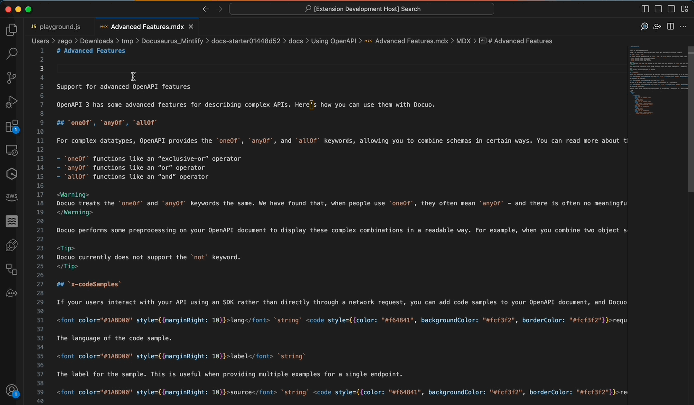
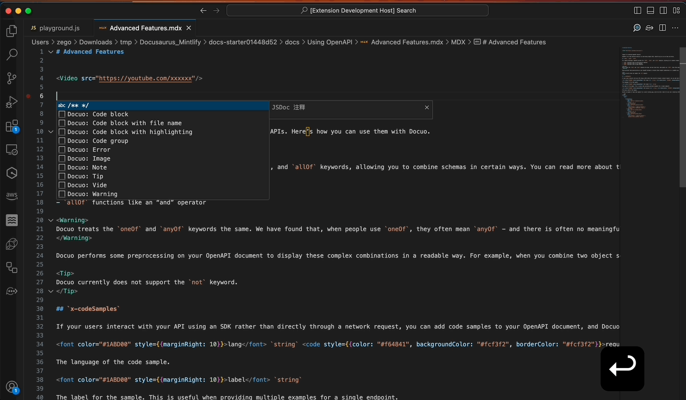
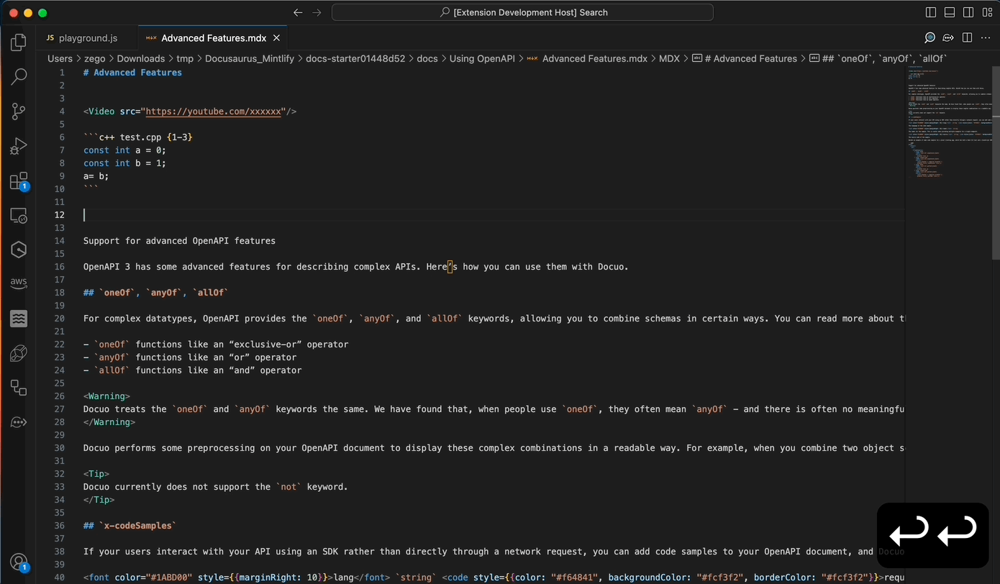

Docuo is a lightweight platform that transforms your static contents into a modern developer hub, API reference, product guides, and more.

Using this tool can exert the most powerful function of Docuo.

- [Home](https://docuo.spreading.ai/via=vsce)
- [Documentation](https://docuo.spreading.io/overview/introduction)

## Trigger Suggest

When you open MD and MDX documents, you can use the `Trigger Suggest` command to trigger the quick completion of Components provided by Docuo.

| Suggest      | Description                                 |
| :----------- | :------------------------------------------ |
| Docuo: Image | Insert image with <Frame> component>.       |
| Docuo: Video  | Insert Youtube,Vimeo and Loom online video. |
|Docuo: Tip|Insert Tip callout|
|Docuo: Note|Insert Note callout|
|Docuo: Warning|Insert Warning callout|
|Docuo: Error|Insert Error callout|
|Docuo: Code block|Insert a simple code block|
|Docuo: Code block with file name|Insert a code block with file name|
|Docuo: Code block with highlighting|Insert a code block with highlighting lines|
|Docuo: Code group|Use <CodeGroup> to aggregate multiple code blocks into one code group.|

